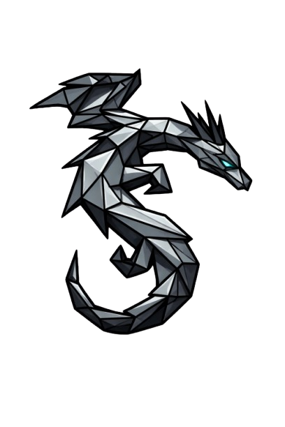

<h2>
🧠 Sobre mim

</h2>

Desenvolvedor Full Stack em formação, focado na construção de aplicações web bem estruturadas.

Tenho interesse em compreender como front-end e back-end se integram na prática, buscando escrever código organizado, funcional e escalável. Estou constantemente aprimorando lógica, arquitetura de projetos e boas práticas para evoluir profissionalmente na área.

---

## 💻 Tecnologias

  
  
  
  
  
  

---

## 🧠 Como eu programo
- Priorizo organização e legibilidade de código  
- Busco separar responsabilidades corretamente  
- Prefiro entender o problema antes de começar a codar  
- Evoluo projetos de forma estruturada e incremental  

---

## 📫 Contato

  

  

